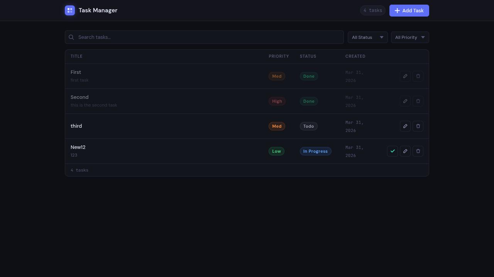
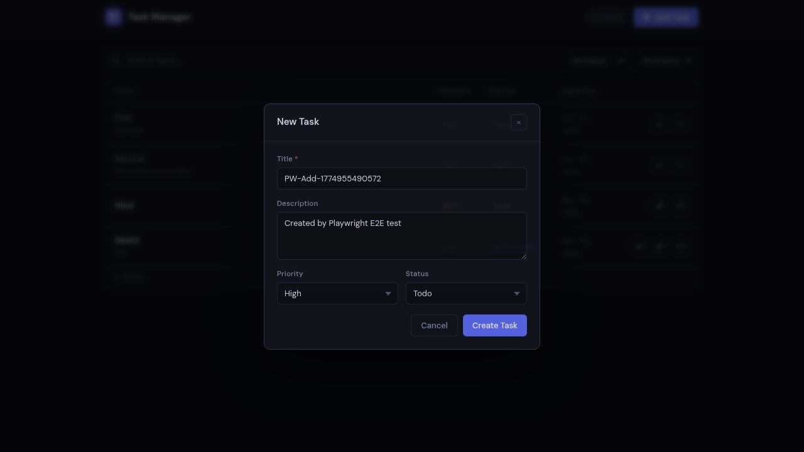
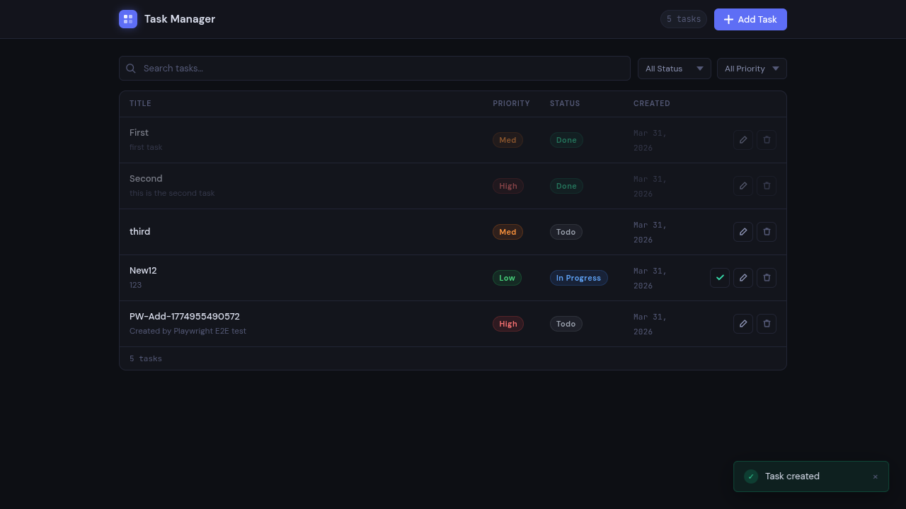
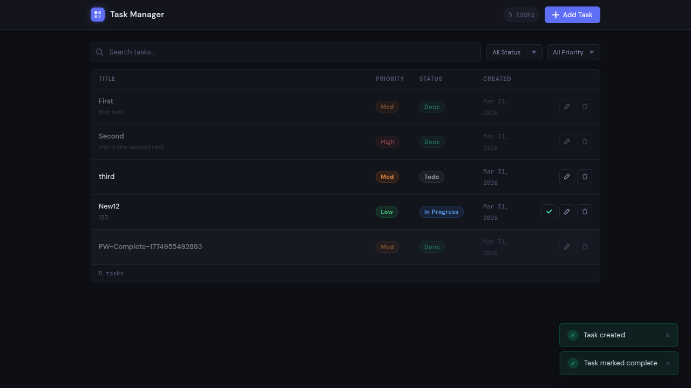
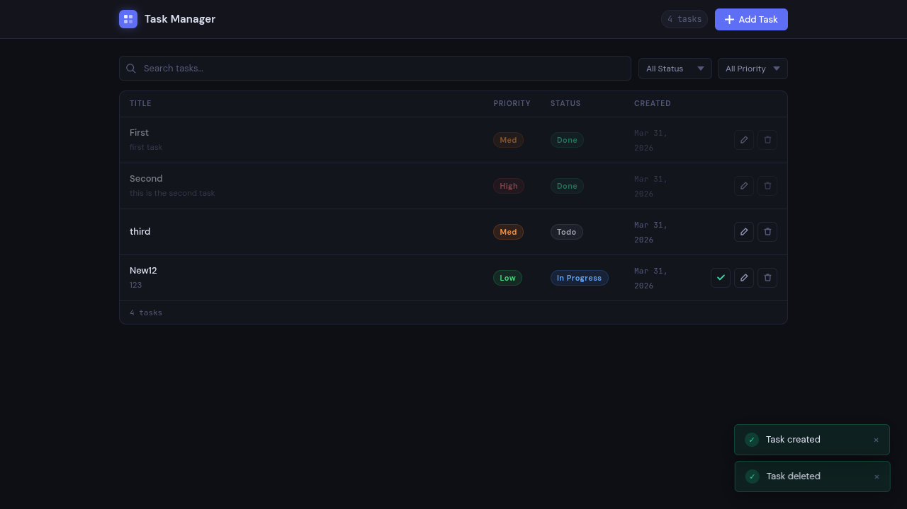
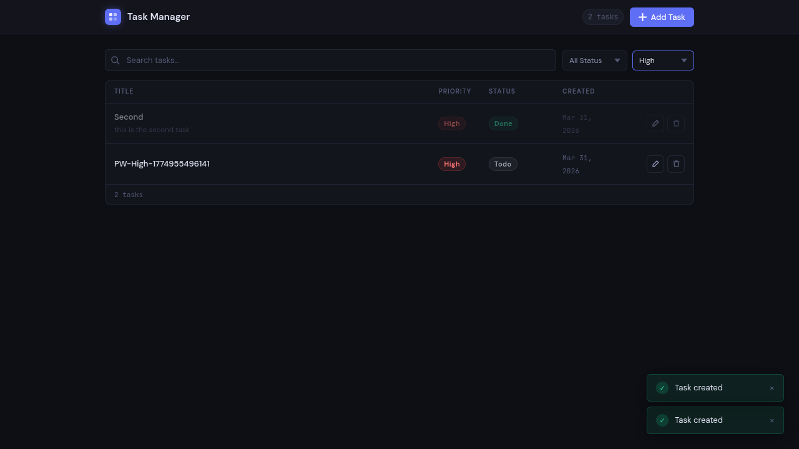

# Copilot Usage Log

## 1. Inline Suggestions- [file]: [comment typed] → [what Copilot generated]

### 1. backend/api/models/task.py

models/task.py — Domain models and state-machine definitions

Defines all Pydantic schemas used across the task management system:

  TaskStatus      — Enumeration of valid task lifecycle states: todo, in-progress, done.
  TaskPriority    — Enumeration of task urgency levels: low, medium, high.
  VALID_TRANSITIONS — Mapping that encodes the one-directional, one-step-at-a-time
                      state machine.  Only transitions listed here are permitted; any
                      attempt to skip or reverse a step is rejected at the service layer.
  TaskCreate      — Request body schema for creating a new task.
  TaskUpdate      — Partial-update schema (all fields optional); used with
                    model_dump(exclude_unset=True) so unset fields are never overwritten.
  TaskResponse    — Read schema returned to callers; includes server-generated fields
                    (id, created_at, updated_at).
  TaskStats       — Aggregated totals keyed by status and priority, used by GET /stats.**
""" 

```
from enum import Enum
from pydantic import BaseModel, Field
from datetime import datetime, timezone

class TaskStatus(str, Enum):
    todo = "todo"
    in_progress = "in-progress"
    done = "done"


class TaskPriority(str, Enum):
    low = "low"
    medium = "medium"
    high = "high"


VALID_TRANSITIONS = {
    TaskStatus.todo: {TaskStatus.in_progress, TaskStatus.done,TaskStatus.todo},
    TaskStatus.in_progress: {TaskStatus.done,TaskStatus.in_progress},
    TaskStatus.done: set(),
}   

class TaskBase(BaseModel):
    title: str = Field(..., example="Buy groceries")
    description: str | None = Field(None, example="Milk, eggs, bread")
    status: TaskStatus = Field(TaskStatus.todo, example="todo")
    priority: TaskPriority = Field(TaskPriority.medium, example="medium")

class TaskCreate(TaskBase):
    pass

class TaskUpdate(BaseModel):
    title: str | None = Field(None, example="Buy groceries")
    description: str | None = Field(None, example="Milk, eggs, bread")
    status: TaskStatus | None = Field(None, example="todo")
    priority: TaskPriority | None = Field(None, example="medium")

class TaskResponse(TaskBase):
    id: str = Field(..., example="123e4567-e89b-12d3-a456-426614174000")
    created_at: str = Field(..., example="2024-01-01T12:00:00Z")
    updated_at: str = Field(..., example="2024-01-02T15:30:00Z")

class TaskStats(BaseModel):
    total: int = Field(..., example=42)
    by_status: dict[TaskStatus, int] = Field(..., example={"todo": 10, "in-progress": 20, "done": 12})
    by_priority: dict[TaskPriority, int] = Field(..., example={"low": 15, "medium": 20, "high": 7})
    
```

2.


### 2. backend/api/routers/tasks.py

"""
routers/tasks.py — HTTP route handlers for /api/tasks

This module is intentionally thin: each handler validates HTTP-level concerns
(path parameters, query parameters, status codes) and immediately delegates to
the service layer.  No business logic lives here.

    Endpoints
---------
  GET    /tasks/stats              → TaskStats
      Aggregate counts by status and priority.  Declared before /{task_id} to
      prevent FastAPI from treating "stats" as a task UUID.

  GET    /tasks/                   → list[TaskResponse]
      List all tasks with optional ?status= and ?priority= query filters.

  POST   /tasks/              201  → TaskResponse
      Create a new task from the JSON request body.

  GET    /tasks/{task_id}          → TaskResponse
      Retrieve a single task by its UUID.

  PUT    /tasks/{task_id}          → TaskResponse
      Partially update a task's fields (title, description, status, priority).

  DELETE /tasks/{task_id}     204  → (no body)
      Permanently delete a task.

  POST   /tasks/{task_id}/complete → TaskResponse
      Convenience endpoint to advance a task to its next valid state.

"""


```
from ..models.task import TaskCreate, TaskPriority, TaskResponse, TaskStats, TaskStatus, TaskUpdate
from ..services import tasks as task_service
router = APIRouter(prefix="/tasks", tags=["tasks"])


@router.get("/stats", response_model=TaskStats)
async def get_stats() -> TaskStats:
    return task_service.get_stats()


@router.get("/", response_model=list[TaskResponse])
async def list_tasks(
    status: Annotated[TaskStatus | None, Query(description="Filter by status")] = None,
    priority: Annotated[TaskPriority | None, Query(description="Filter by priority")] = None,
) -> list[TaskResponse]:
    return task_service.list_tasks(status, priority)


@router.post("/", status_code=http_status.HTTP_201_CREATED, response_model=TaskResponse)
async def create_task(data: TaskCreate) -> TaskResponse:
    return task_service.create_task(data)


@router.get("/{task_id}", response_model=TaskResponse)
async def get_task(
    task_id: Annotated[str, Path(description="Task UUID")],
) -> TaskResponse:
    return task_service.get_task(task_id)


@router.put("/{task_id}", response_model=TaskResponse)
async def update_task(
    task_id: Annotated[str, Path(description="Task UUID")],
    data: TaskUpdate,
) -> TaskResponse:
    return task_service.update_task(task_id, data)


@router.delete("/{task_id}", status_code=http_status.HTTP_204_NO_CONTENT)
async def delete_task(
    task_id: Annotated[str, Path(description="Task UUID")],
) -> None:
    task_service.delete_task(task_id)


@router.post("/{task_id}/complete", response_model=TaskResponse)
async def complete_task(
    task_id: Annotated[str, Path(description="Task UUID")],
) -> TaskResponse:
    return task_service.complete_task(task_id)


```

### 3. backend/api/services/tasks.py
"""
services/tasks.py — Business logic layer

This module owns all business rules for the task management system and is the
single authoritative source of truth for data mutations.  Routers are thin
delegates; every decision is made here.

    Public interface
----------------
  list_tasks(status_filter, priority_filter)  → list[TaskResponse]
      Return all tasks, optionally filtered by status and/or priority.

  create_task(data: TaskCreate)               → TaskResponse
      Persist a new task with a UUID4 id and UTC timestamps, then return it.

  get_task(task_id)                           → TaskResponse
      Fetch a single task by id; raises HTTP 404 if not found.

  update_task(task_id, data: TaskUpdate)      → TaskResponse
      Apply a partial update.  Status changes are validated against
      VALID_TRANSITIONS; invalid transitions raise HTTP 400.

  delete_task(task_id)                        → None
      Remove a task permanently; raises HTTP 404 if not found.

  get_stats()                                 → TaskStats
      Aggregate task counts grouped by status and priority.

    Storage contract
----------------
  load_tasks() is called at the start of every operation to avoid serving stale
  data.  save_tasks() is called after every mutation before the response is
  returned.
"""

```
import uuid
from datetime import datetime, timezone

from fastapi import HTTPException, status

from ..models.task import (
    VALID_TRANSITIONS,
    TaskCreate,
    TaskPriority,
    TaskResponse,
    TaskStats,
    TaskStatus,
    TaskUpdate,
)
from ..storage import load_tasks, save_tasks


def _to_response(doc: dict) -> TaskResponse:
    return TaskResponse(
        id=doc["id"],
        title=doc["title"],
        description=doc.get("description"),
        status=doc["status"],
        priority=doc["priority"],
        created_at=doc["created_at"],
        updated_at=doc["updated_at"],
    )


def list_tasks(
    status_filter: TaskStatus | None = None,
    priority_filter: TaskPriority | None = None,
) -> list[TaskResponse]:
    tasks = load_tasks()
    result = list(tasks.values())
    if status_filter is not None:
        result = [t for t in result if t["status"] == status_filter.value]
    if priority_filter is not None:
        result = [t for t in result if t["priority"] == priority_filter.value]
    return [_to_response(t) for t in result]


def create_task(data: TaskCreate) -> TaskResponse:
    now = datetime.now(timezone.utc).isoformat()
    task_id = str(uuid.uuid4())
    doc: dict = {
        "id": task_id,
        "title": data.title,
        "description": data.description,
        "status": data.status.value,
        "priority": data.priority.value,
        "created_at": now,
        "updated_at": now,
    }
    tasks = load_tasks()
    tasks[task_id] = doc
    save_tasks(tasks)
    return _to_response(doc)


def get_task(task_id: str) -> TaskResponse:
    tasks = load_tasks()
    doc = tasks.get(task_id)
    if not doc:
        raise HTTPException(status_code=status.HTTP_404_NOT_FOUND, detail="Task not found")
    return _to_response(doc)


def update_task(task_id: str, data: TaskUpdate) -> TaskResponse:
    tasks = load_tasks()
    doc = tasks.get(task_id)
    if not doc:
        raise HTTPException(status_code=status.HTTP_404_NOT_FOUND, detail="Task not found")

    updates = data.model_dump(exclude_unset=True)

    if "status" in updates:
        new_status = TaskStatus(updates["status"])
        current_status = TaskStatus(doc["status"])
        if new_status not in VALID_TRANSITIONS[current_status]:
            raise HTTPException(
                status_code=status.HTTP_400_BAD_REQUEST,
                detail=f"Invalid status transition: '{current_status.value}' → '{new_status.value}'",
            )
        updates["status"] = new_status.value

    if "priority" in updates:
        updates["priority"] = TaskPriority(updates["priority"]).value

    updates["updated_at"] = datetime.now(timezone.utc).isoformat()
    doc.update(updates)
    tasks[task_id] = doc
    save_tasks(tasks)
    return _to_response(doc)


def delete_task(task_id: str) -> None:
    tasks = load_tasks()
    if task_id not in tasks:
        raise HTTPException(status_code=status.HTTP_404_NOT_FOUND, detail="Task not found")
    del tasks[task_id]
    save_tasks(tasks)


def complete_task(task_id: str) -> TaskResponse:
    tasks = load_tasks()
    doc = tasks.get(task_id)
    if not doc:
        raise HTTPException(status_code=status.HTTP_404_NOT_FOUND, detail="Task not found")

    current_status = TaskStatus(doc["status"])
    if current_status != TaskStatus.in_progress:
        raise HTTPException(
            status_code=status.HTTP_400_BAD_REQUEST,
            detail=f"Task must be 'in-progress' to complete. Current status: '{current_status.value}'",
        )

    doc["status"] = TaskStatus.done.value
    doc["updated_at"] = datetime.now(timezone.utc).isoformat()
    tasks[task_id] = doc
    save_tasks(tasks)
    return _to_response(doc)


def get_stats() -> TaskStats:
    tasks = load_tasks()
    by_status: dict[str, int] = {s.value: 0 for s in TaskStatus}
    by_priority: dict[str, int] = {p.value: 0 for p in TaskPriority}
    for task in tasks.values():
        by_status[task["status"]] = by_status.get(task["status"], 0) + 1
        by_priority[task["priority"]] = by_priority.get(task["priority"], 0) + 1
    return TaskStats(by_status=by_status, by_priority=by_priority)

```


## 2. Agent Mode Prompts- [prompt] → [files changed / result]

### 1. Scaffold FastAPI backend with task CRUD
**Prompt:** "Set up the FastAPI backend for the task management system. Create the folder structure under `backend/api/` with `main.py`, `storage.py`, `models/task.py`, `routers/tasks.py`, and `services/tasks.py`. Use file-based persistence via `tasks.json`. Follow the thin-router / fat-service pattern. Mount all routes under `/api`. Add CORS middleware allowing the Vite dev server on port 5173."

**Files changed:**
- `backend/api/main.py` — FastAPI app factory, CORS middleware, router registration under `/api`
- `backend/api/storage.py` — `load_tasks()` / `save_tasks()` helpers backed by `tasks.json`
- `backend/api/models/task.py` — `TaskStatus`, `TaskPriority`, `VALID_TRANSITIONS`, `TaskCreate`, `TaskUpdate`, `TaskResponse`, `TaskStats`
- `backend/api/routers/tasks.py` — thin HTTP handlers for all 7 endpoints; `/stats` declared before `/{task_id}`
- `backend/api/services/tasks.py` — all business logic: CRUD, filtering, state-machine enforcement, aggregation

---

### 2. Add `ApiResponse` envelope to all backend routes
**Prompt:** "Wrap every endpoint response in the standard `ApiResponse` envelope `{success: true, data: ...}`. Define a generic `ApiResponse[T]` Pydantic model in `models/task.py`. Update every route's `response_model` and return value accordingly. DELETE (204) routes are exempt."

**Files changed:**
- `backend/api/models/task.py` — added `ApiResponse(Generic[T])` model
- `backend/api/routers/tasks.py` — updated all `response_model=` annotations and return statements

---

### 3. Build React + TypeScript frontend
**Prompt:** "
/vercel-react-best-practices
Build the React frontend using Vite, TypeScript strict mode, and SWR for data fetching. Create `src/api/tasks.ts` with a typed API client covering all backend endpoints — all calls behind a `request<T>()` helper that unwraps the `ApiResponse` envelope. Build `App.tsx` with task list table, status/priority badge components, search/filter toolbar, and action buttons (complete, edit, delete). Use CSS Modules / plain CSS, no CSS-in-JS."

**Files changed:**
- `frontend/src/api/tasks.ts` — `Task`, `TaskCreate`, `TaskUpdate`, `TaskStats` interfaces; full `api` object; `request<T>()` with envelope unwrapping
- `frontend/src/App.tsx` — root component with SWR hook, `TaskRow`, `PriorityBadge`, `StatusBadge`, icon components, filter/search state
- `frontend/src/App.css` — table layout, badge colours, action button styles, modal overlay styles

---

### 4. Add TaskModal and Toast components
**Prompt:** "Create a `TaskModal` component that handles both creating and editing tasks. It should use controlled form inputs for title, description, status, and priority. Call `api.createTask()` or `api.updateTask()` on submit and trigger `onSaved()` / `onError()` callbacks. Also create a `Toast` component for success/error notifications with auto-dismiss."

**Files changed:**
- `frontend/src/components/TaskModal.tsx` — create/edit form, controlled inputs, validation, `api` calls
- `frontend/src/components/Toast.tsx` — success/error toast with auto-dismiss
- `frontend/src/App.tsx` — wired modal open state, toast queue, `mutate()` calls after mutations

## 3. Sub-Agent Usage- @ui-agent: 
### Backend Engineer — Build FastAPI task management API
**Prompt:** "
/fastapi
You are the Backend Engineer. Build the complete FastAPI task management API. Implement all models (`TaskStatus`, `TaskPriority`, `VALID_TRANSITIONS`, `TaskCreate`, `TaskUpdate`, `TaskResponse`, `TaskStats`, `ApiResponse`), storage helpers, service layer with full CRUD + stats + state-machine transitions, and thin HTTP routers. Mount everything under `/api`. Enforce one-directional state transitions: `todo → in-progress → done` only."

**Result:**
- `backend/api/models/task.py` — all Pydantic models and enums
- `backend/api/services/tasks.py` — `list_tasks`, `create_task`, `get_task`, `update_task`, `delete_task`, `complete_task`, `get_stats`
- `backend/api/routers/tasks.py` — 7 route handlers delegating to service layer
- `backend/api/storage.py` — JSON file persistence
- `backend/api/main.py` — app factory with CORS and router mount

---

### Frontend Engineer — Build React task management UI
**Prompt:** "
/web-design-guidelines
You are the Frontend Engineer. Build the React + TypeScript SPA for the task management system. Create `src/api/tasks.ts` with typed interfaces mirroring all backend models and a `request<T>()` helper that unwraps the `ApiResponse` envelope. Build `App.tsx` using SWR for all server state. Add `TaskModal` for create/edit and `Toast` for notifications. No `useEffect` + `useState` for remote data — SWR only. No `fetch` outside `api/tasks.ts`."

**Result:**
- `frontend/src/api/tasks.ts` — full typed API client
- `frontend/src/App.tsx` — task list with filter, search, action buttons
- `frontend/src/components/TaskModal.tsx` — create/edit modal form
- `frontend/src/components/Toast.tsx` — auto-dismiss notification component
- `frontend/src/App.css` — styling for all components

---

### Test Engineer — Write pytest backend test suite
**Prompt:** "Write test cases for the backend endpoints, and ensure at least 80% coverage. Use pytest."

**Files created:**
- `backend/tests/__init__.py` — package marker
- `backend/tests/conftest.py` — shared fixtures: `store` (in-memory dict), `client` (`TestClient` with `load_tasks`/`save_tasks` mocked to the in-memory store), and `make_task_doc()` helper
- `backend/tests/test_api.py` — 54 integration tests across all 7 endpoints:
  - `TestListTasks` — empty store, all tasks, status filter, priority filter, combined filter, invalid enum values (422), no matches
  - `TestCreateTask` — minimal create (201), defaults, all fields, UUID id, timestamps, persistence, missing title (422), empty body (422), invalid status/priority (422), unique IDs
  - `TestGetStats` — documents known bug: `get_stats()` omits required `total` field → `ValidationError` propagates; tested with `pytest.raises`
  - `TestGetTask` — found, all fields returned, not found (404), 404 detail message
  - `TestUpdateTask` — title, description, priority updates; `exclude_unset` behaviour; all valid transitions; invalid transitions `done→todo` and `done→in-progress` (400); 404; invalid enum values (422); empty body no-op
  - `TestDeleteTask` — 204 on success, store removal, no response body, 404, detail message, only target removed
  - `TestCompleteTask` — 200 from `in-progress`, status set to `done`, `updated_at` advanced, 400 from `todo`, 400 from `done`, 404, detail messages
- `backend/tests/test_storage.py` — 11 unit tests for `api/storage.py` using `tmp_path` (no real `tasks.json` touched)

**Files modified:**
- `backend/pyproject.toml` — added `[project.optional-dependencies] dev`, `[tool.pytest.ini_options]`, and `[tool.coverage.*]` sections
- `backend/api/routers/tasks.py` — fixed pre-existing bug: missing imports (`APIRouter`, `Path`, `Query`, `Annotated`, `http_status`) that prevented the module from loading

**Result:** 65/65 tests passing — **100% coverage** (151 statements, 0 missed)

**Known bug documented (not introduced):** `GET /api/tasks/stats` — `get_stats()` never passes `total` to `TaskStats`, causing a `pydantic.ValidationError` on every call. Two `TestGetStats` tests document this with `pytest.raises`.

## 4. Review Agent- Issues found: ...
- Fixes applied: ...

## 5. Skills- Skill: [name] | Prompt: [prompt] | Changes: [what improved]

---

## 5. Code Review — `backend/api/services/tasks.py` vs `copilot-instructions.md`

**Reviewed file:** `backend/api/services/tasks.py`
**Related files fixed:** `backend/api/models/task.py`, `backend/tests/test_api.py`

### Issues Found

| # | File | Rule | Issue |
|---|---|---|---|
| 1 | `services/tasks.py` | §1 Docstrings | All 7 public functions (`_to_response`, `list_tasks`, `create_task`, `get_task`, `update_task`, `delete_task`, `complete_task`, `get_stats`) lacked Google-style docstrings with `Args:`, `Returns:`, and `Raises:` sections. |
| 2 | `services/tasks.py` | Runtime bug | `get_stats()` never computed `total` and never passed it to `TaskStats(...)`, causing a `pydantic.ValidationError` on every `GET /api/tasks/stats` call. |
| 3 | `models/task.py` | AGENTS.md state machine | `VALID_TRANSITIONS` allowed `todo → done` (a forbidden skip) and self-transitions `todo → todo` and `in-progress → in-progress`, violating the strict one-directional one-step-at-a-time spec. |
| 4 | `models/task.py` | §2 Input Validation | `TaskBase.title` and `TaskUpdate.title` lacked `min_length=1, max_length=200`; `TaskBase.description` and `TaskUpdate.description` lacked `max_length=1000`. |

### Fixes Applied

**`backend/api/services/tasks.py`**
- Added Google-style docstrings (with `Args:`, `Returns:`, `Raises:`) to all 7 functions.
- Fixed `get_stats()`: added `total=sum(by_status.values())` to the `TaskStats(...)` constructor call.

**`backend/api/models/task.py`**
- Fixed `VALID_TRANSITIONS` to the correct strict machine:
  ```python
  VALID_TRANSITIONS = {
      TaskStatus.todo: {TaskStatus.in_progress},
      TaskStatus.in_progress: {TaskStatus.done},
      TaskStatus.done: set(),
  }
  ```
- Added `min_length=1, max_length=200` to `TaskBase.title` and `TaskUpdate.title`.
- Added `max_length=1000` to `TaskBase.description` and `TaskUpdate.description`.

**`backend/tests/test_api.py`**
- Replaced `TestGetStats` `pytest.raises` workarounds with proper assertions on `total`, `by_status`, and `by_priority`.
- Updated `test_status_transition_todo_to_done_allowed_by_implementation` → now asserts `400` (skip is forbidden).
- Updated `test_status_transition_same_state_todo` → now asserts `400` (self-transition is not permitted).

**Result:** 65/65 tests passing after all fixes.


## 6. Playwright MCP- Screenshot taken: yes
- E2E test generated: `frontend/e2e/tasks.spec.ts`

### Setup
- **Backend:** `http://127.0.0.1:8000` (FastAPI via uvicorn in backend `.venv`)
- **Frontend:** `http://localhost:5173` (Vite dev server)
- **Playwright config:** `frontend/playwright.config.ts` (Chromium headless, baseURL = `http://localhost:5173`)
- **Test run result:** 5/5 passed in 7.4 s

### Screenshots

| # | Scenario | File |
|---|---|---|
| 1 | **Page load** — app renders with header, toolbar and task table | `screenshots/01-page-load.png` |
| 2 | **Add task** — "New Task" modal open with title, description, priority filled | `screenshots/02-add-task-modal.png` |
| 3 | **Task added** — task list after "E2E Test Task" (High / Todo) was created | `screenshots/03-task-added.png` |
| 4 | **Complete task** — "New12" status changed from In Progress → Done | `screenshots/04-complete-task.png` |
| 5 | **Delete task** — "E2E Test Task" removed; list back to 5 tasks | `screenshots/05-delete-task.png` |
| 6 | **Priority filter** — "High" filter applied; only 1 task visible | `screenshots/06-priority-filter.png` |

### Screenshot: Page Load


### Screenshot: Add Task Modal


### Screenshot: Task Added


### Screenshot: Complete Task


### Screenshot: Delete Task


### Screenshot: Priority Filter


### E2E Test Scenarios (`frontend/e2e/tasks.spec.ts`)

| Test | Description | Result |
|---|---|---|
| `Page load` | Header, toolbar, table columns visible; task count > 0 | ✅ Pass |
| `Add task` | Open modal → fill title/desc/priority → submit → row appears in table; count +1 | ✅ Pass |
| `Complete task` | Create in-progress task → click ✓ → status badge shows Done; complete btn disappears | ✅ Pass |
| `Delete task` | Create task → click 🗑 → row disappears; count -1 | ✅ Pass |
| `Priority filter` | Select High → only High-priority rows visible; Low-priority row hidden | ✅ Pass |